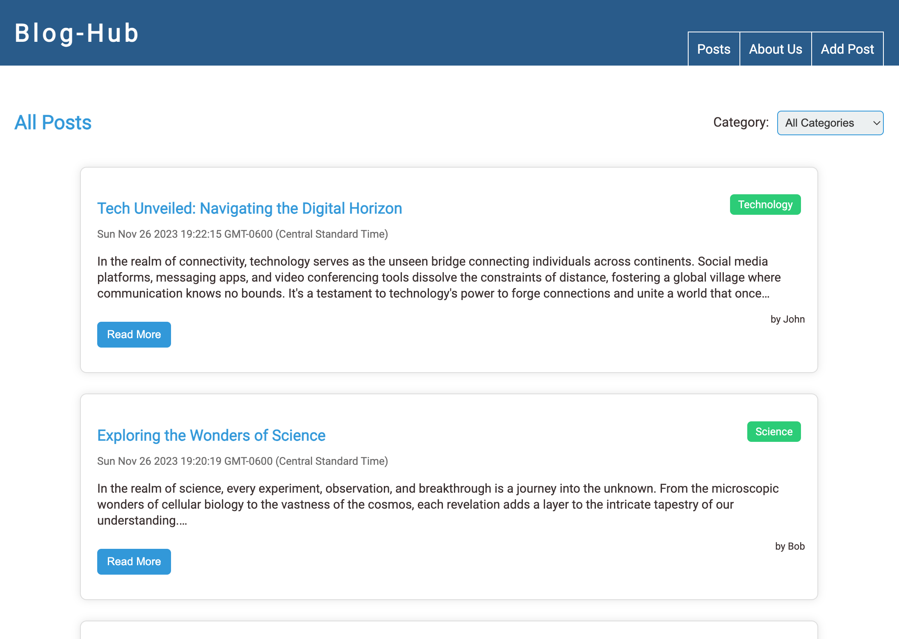
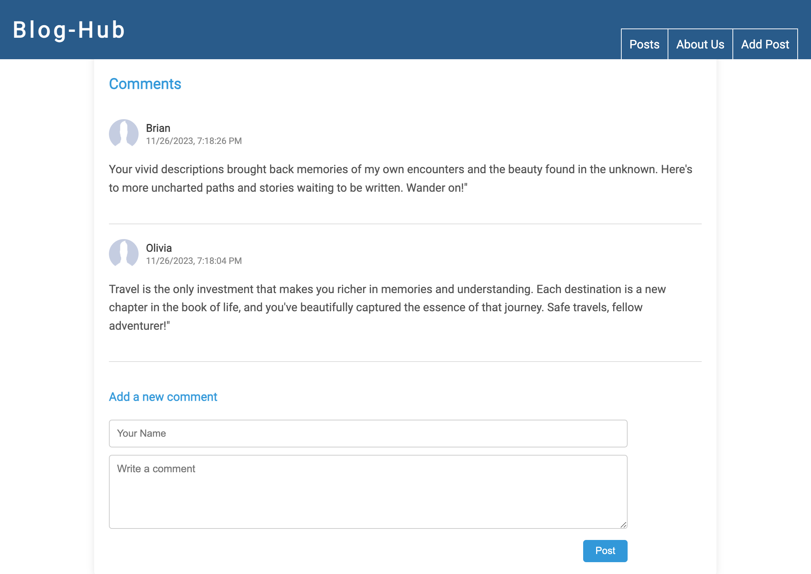
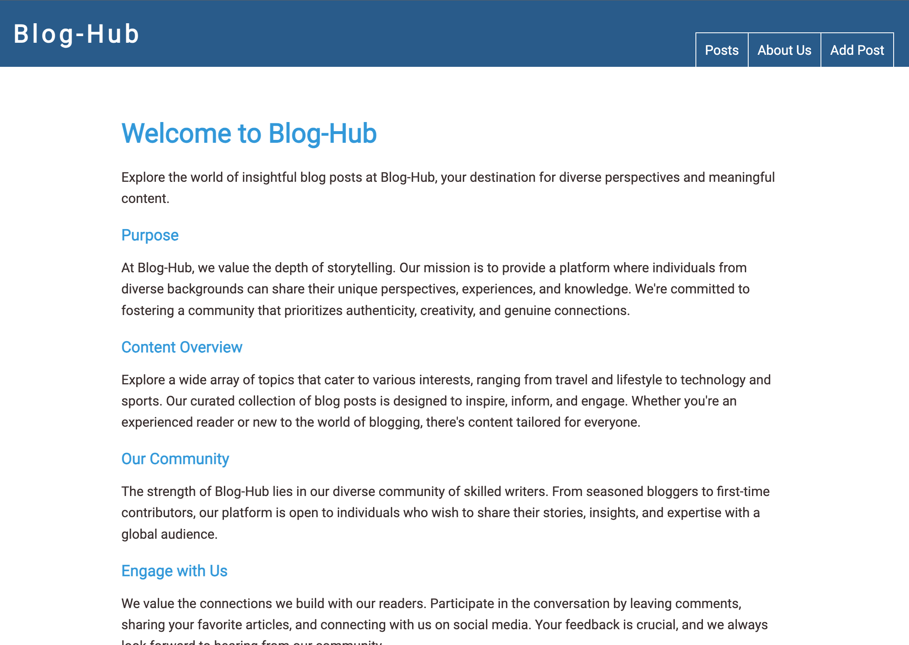
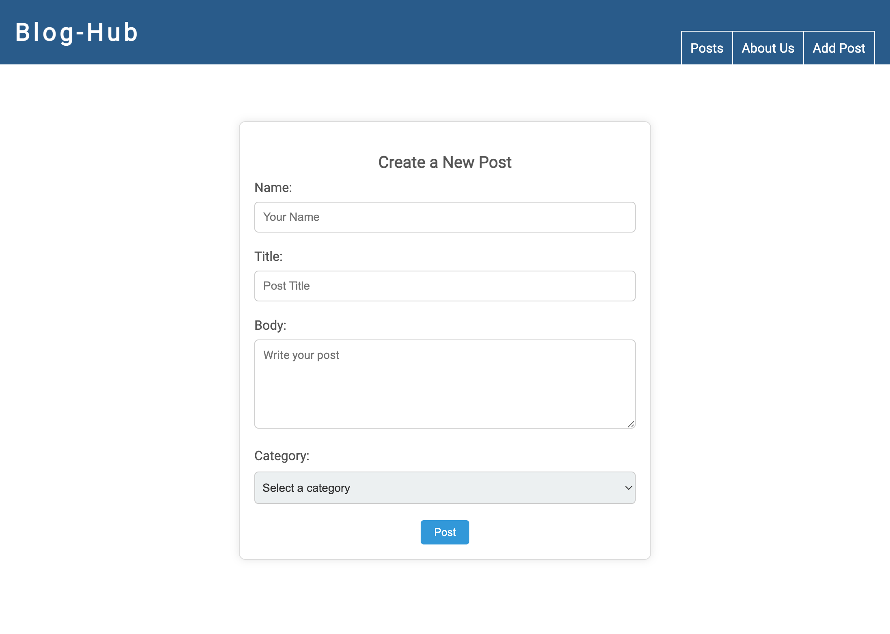

# Blog-hub (NodeJS)

## 📖  Description

Blog-Hub is a sophisticated web application that serves as a learning playground, showcasing the implementation of key technologies, Node.js, MongoDB, and the Model-View-Controller (MVC) architectural pattern. Created with educational purposes in mind, Blog-Hub provides a practical example of these technologies working harmoniously to build a dynamic and feature-rich blogging platform.

## 💻  Technologies

- 🚀 Node.js-Powered Backend
- 🍃 MongoDB Database Integration
- 🏗️ MVC Architecture in Action
- 🛤️ Express.js Framework
- 🌐 HTML Template Engine (EJS)
- 🚀 JavaScript Interactivity
- 🎨 CSS Styling

## 🖼️   Screenshots

## 🌟  Features

- Responsive Design
- Dynamic Blog Creation
- Comments and Feedback
- Category Filtering

## 🔧  Installation

1. Install Node.js, npm, and MongoDB on your machine.
2. Clone this repository to your local machine using `git clone`.
3. Navigate to the project directory.
4. Install the project dependencies: `npm install`
5. Start the application: `node app` or `nodemon app`  
6. Access the app on: `http://localhost:4000`

## 📧  Contact

- Stipan Mad¾ar
- ?? Email: smadzar90@student.se.edu
- ?? GitHub: [https://github.com/smadzar90](https://github.com/smadzar90)
- ?? LinkedIn: [https://www.linkedin.com/in/stipan-madzar-b6b857225/](https://www.linkedin.com/in/stipan-madzar-b6b857225/)
